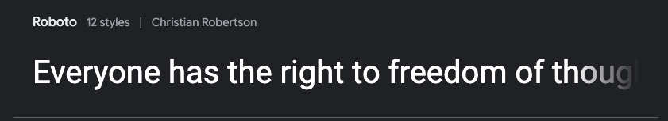

# Project Portfolio2 - WAEC Prep Arena(Test)

### Link to Deployed Site: [WAEC Prep Arena](https://samuel-senesie.github.io/pp2-waec-prep-arena-ci/)

---

## Introduction 
The WAEC Prep Arena Test game is the second portfolio project developed as part of the Code Institute’s Full-Stack Software Development Diploma course. This web-based, interactive test utilizes HTML, CSS, and JavaScript to create a front-end experience.

The game is specifically designed for students preparing for public examinations administered by the West African Examination Council (WAEC). It is particularly useful for Junior and Senior Secondary school students preparing for the Basic Education Certificate Examination (BECE) and the West African Senior Secondary Certificate Examination (WASSCE). However, it is also open to anyone interested in testing their knowledge in selected subjects.

The test is divided into two levels: Junior Secondary School (JSS) and Senior Secondary School (SSS), with four subjects available at each level. Each subject contains 15 questions, and each question offers four possible answers. Users are expected to select the correct answer within one minute. Upon completing the test, users are provided with a review of the questions, showing their selected answers alongside the correct ones to aid in learning.

A leaderboard displays each user's total score at the end of the test.

## Table of Contents

* [Introduction](#introduction)

* [User Experience](#user-experience)
  * [User Stories](#user-stories)

* [Design](#design)
  * [Wireframes](#wireframes)
  * [Color Sceme](#color-scheme)
  * [Typography](#typograpgy)
  * [Imagery](#imagery)

* [Feautures](#features)
  * [Current Features](#current-features)
    * [Generla Features](#general-features)
    * [Test Page](#test-page)
  * [Future Features](#future-features) 

* [Validation](#validation)
  * [HTML](#html)
  * [CSS](#css)
  * [JavaScript](#javascripts)

* [Testing](#testing)
  * [User Stories Testing](#user-stories-testing)
  * [Lighthouse Testing](#lighthouse-testing)
  * [Responsive Testing](#responsive-testing)
  * [Accessibility Testing](#accessibility-testing)
  * [Mannual Testing](#manual-testing)

* [Deployment & Local Deployment](#deployment-and-local-deployment)
  * [Remote Deployment](#remote-deployment)
  * [Local Deployment](#local-deployment)
    * [How to Fork](#how-to-fork)
    * [How to Clone](#how-to-clone)

* [Technologies Used](#technologies-used)

---

## User Experience
This project aims to deliver an interactive front-end website that provides a test game experience, primarily for students preparing for the BECE and WASSCE examinations.

### User Stories
  * I want to use the website on various devices, including smartphones, tablets, laptops, and desktops.
  * I want to understand the game rules and instructions before attempting the test.
  * I want to create a username.
  * I want to be able to select my preferred level, subject, and the year of the past examination question I wish to try.
  * I want to track my time and see how much time I have remaining.
  * I want to keep track of my scores and the remaining questions while playing.
  * I want to be able to pause and resume the test without losing time.
  * I want feedback indicating wheather my answeres are correct or incorrect and notifications when I pause or resume the game.
  * I want to see the review of the questions and the correct answeres at the end of the test.
  * I want an option to restart the game.
  * I want to see my score on the leaderboard.

  ---

## Design

### Color Scheme
Shades of blue were chosen as the primary colors for the website due to their association with confidence and intelegence. The color palette, shown in the image below, was generated using [Coolors](https://coolors.co/) tool.

The colour selection for the main features of the website is as follows:
  * #003366 was used for the background of the web pages.
  * #66CCFF was used as the primary colour for the buttons.
  * #007BFF was applied as the background color for popup windows and the test section.
  * #FFFFFF was used for the H1 elements and icons.
  * #000000 was used for H2, H3 and paragraph elements.
  * #008000 was used for the time bar.

### Typography
[Google Fonts](https://fonts.google.com/) was used to find an appropiate font family and generate and import the necessary code. Robot and san-serif fonts were selected as the primary font family for the website due to the readability and professional appearance. 

- 

## Credits

* The popup menu was learnt ad adapted from the YouTube Tutorial of [Codingflag](https://youtu.be/iE_6pQ3RlZU?si=6_qy3F1wWourONax)

