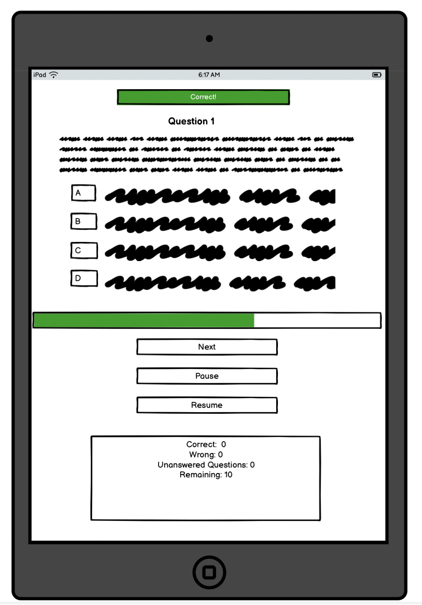
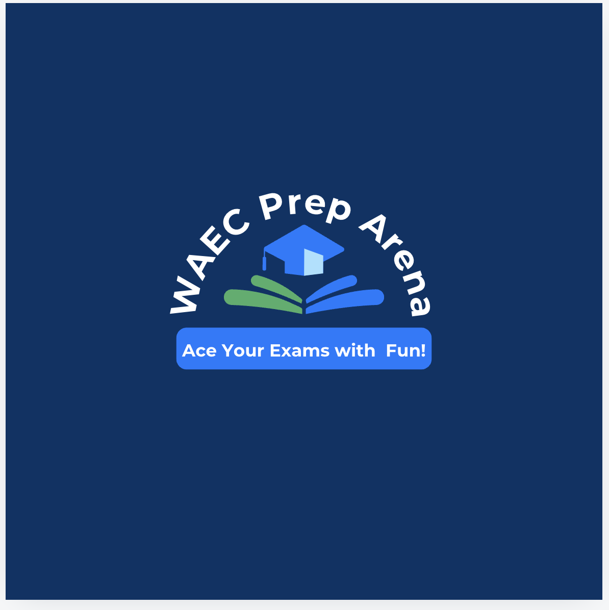

# Project Portfolio2 - WAEC Prep Arena(Test)

### Link to Deployed Site: [WAEC Prep Arena](https://samuel-senesie.github.io/pp2-waec-prep-arena-ci/)

---

## Introduction 
The WAEC Prep Arena Test game is the second portfolio project developed as part of the Code Institute’s Full-Stack Software Development Diploma course. This web-based, interactive test utilizes HTML, CSS, and JavaScript to create a front-end experience.

The game is specifically designed for students preparing for public examinations administered by the West African Examination Council (WAEC). It is particularly useful for Junior and Senior Secondary school students preparing for the Basic Education Certificate Examination (BECE) and the West African Senior Secondary Certificate Examination (WASSCE). However, it is also open to anyone interested in testing their knowledge in selected subjects.

The test is divided into two levels: Junior Secondary School (JSS) and Senior Secondary School (SSS), with four subjects available at each level. Each subject contains 15 questions, and each question offers four possible answers. Users are expected to select the correct answer within one minute. Upon completing the test, users are provided with a review of the questions, showing their selected answers alongside the correct ones to aid in learning.

A leaderboard displays each user's total score at the end of the test.

## Table of Contents

* [Introduction](#introduction)

* [User Experience](#user-experience)
  * [User Stories](#user-stories)

* [Design](#design)
  * [Wireframes](#wireframes)
  * [Color Sceme](#color-scheme)
  * [Typography](#typograpgy)
  * [Imagery](#imagery)

* [Feautures](#features)
  * [Current Features](#current-features)
    * [Home Page](#home-page)
    * [Test Page](#test-page)
  * [Future Features](#future-features) 

* [Validation](#validation)
  * [HTML](#html)
  * [CSS](#css)
  * [JavaScript](#javascripts)

* [Testing](#testing)
  * [User Stories Testing](#user-stories-testing)
  * [Lighthouse Testing](#lighthouse-testing)
  * [Responsive Testing](#responsive-testing)
  * [Accessibility Testing](#accessibility-testing)
  * [Mannual Testing](#manual-testing)

* [Deployment & Local Deployment](#deployment-and-local-deployment)
  * [Remote Deployment](#remote-deployment)
  * [Local Deployment](#local-deployment)
    * [How to Fork](#how-to-fork)
    * [How to Clone](#how-to-clone)

* [Technologies Used](#technologies-used)

---

## User Experience
This project aims to deliver an interactive front-end website that provides a test game experience, primarily for students preparing for the BECE and WASSCE examinations.

---

### User Stories
  * I want to use the website on various devices, including smartphones, tablets, laptops, and desktops.
  * I want to understand the game rules and instructions before attempting the test.
  * I want to create a username.
  * I want to be able to select my preferred level, subject, and the year of the past examination question I wish to try.
  * I want to track my time and see how much time I have remaining.
  * I want to keep track of my scores and the remaining questions while playing.
  * I want to be able to pause and resume the test without losing time.
  * I want feedback indicating wheather my answeres are correct or incorrect and notifications when I pause or resume the game.
  * I want to see the review of the questions and the correct answeres at the end of the test.
  * I want an option to restart the game.
  * I want to see my score on the leaderboard.

  ---

## Design

### Wireframes
[Balsamiq](https://www.balsamiq.com) was used to create the wireframes for this project, covering mobile, tablet, and desktop versions. The final design differs slightly from the wireframes due to changes made during the development stage. Images of the wireframes are included in the attachments.
 

Wireframe for Mobile phones

Wireframe for Tablets

Wireframe for Desktops

### Color Scheme
Shades of blue were chosen as the primary colors for the website due to their association with confidence and intelegence. The color palette, shown in the image below, was generated using [Coolors](https://coolors.co/) tool.

The colour selection for the main features of the website is as follows:
  * #003366 was used for the background of the web pages.
  * #66CCFF was used as the primary colour for the buttons.
  * #007BFF was applied as the background color for popup windows and the test section.
  * #FFFFFF was used for the H1 elements and icons.
  * #000000 was used for H2, H3 and paragraph elements.
  * #008000 was used for the time bar.

### Typography
[Google Fonts](https://fonts.google.com/) was used to find an appropiate font family and generate and import the necessary code. Robot and san-serif fonts were selected as the primary font family for the website due to the readability and professional appearance. 

- 
---
### Imagery
Canva was used to generate the logo featured on the background image of the homepage. The book and graduation cap in the logo symbolize education and success.

---
## Features
### Current features
The website, which includes a visible favicon, consists of two main pages: `index.html` (Home page) and `game.html` (Test page). Both pages feature the logo as the background image, with an overlay to dim the background when pop-up windows or other dynamic features are displayed.

### Home page

The Home page features two buttons—“About Game” and “Let’s Go!”—with the logo as the background image. The “Let’s Go!” button navigates users to the test section. When clicked, the “About Game” button opens a pop-up window containing three buttons: one for the “Instructions” pop-up, one for the “Game Rules” pop-up, and one to close the pop-up window.

* Home

### Test Page
#### Username and Level Selection Section
To navigate to the test page, users click on the “Let’s Go!” button, which takes them to the section where they can enter a username and select a level. Users are only allowed to select a level after creating a username. Once a username is created and a level is selected, users can proceed to the subject selection section, which is loaded dynamically.

#### Subject Selection
Each level offers four subject options, and users can only select one subject at a time. After selecting a subject, users can navigate to the start page.

#### Select Year and Start Test
The start button on the start page is only functional after the user has selected the year of the past paper they wish to try from the dropdown menu.

#### Test display Section

* This section displays the test question with four answer options, a progress (timer) bar, in-page notifications, a score tracker, a next button, and pause and resume buttons.

* The question page with four answer options is displayed after clicking the start button. This page also features a timer bar and a score display section. Users are required to spend no more than 1 minute per question. The timer starts once the question is displayed. The timer bar, located just below the answers, is green and full at 60 seconds, turns orange and half-full at 30 seconds, and turns red when there are 10 seconds remaining.

*	During the test, users can pause and resume the game at will. When the game is paused, the questions and answer options are hidden, and the timer stops. The questions and answer options are displayed again when the user resumes, and the timer will continue running.

* Users receive notifications such as “Correct!” for correct answers, “Try again later!” for incorrect answers, “Do you want to come back later?” for skipped questions, and “Test completed” at the end of the test. Users are also informed when they click the pause or resume buttons.

* The score tracker is displayed at the bottom of the page, showing the count of correct, incorrect, and unanswered questions, as well as the number of questions remaining.

#### Test Review Section
At the end of the test, the review section will display all the questions, showing the user’s selected answers and the correct answers. A restart button is located at the bottom of the page, which users can use to navigate back to the level selection area and restart the test.

#### Leaderboard

At the end of the test, the user’s name, level, subject, and score (in percentage) are displayed on the leaderboard.

### Future Features
* A signup and login option for users.
* Hints to help users select the correct answers.
* Additional subject options, questions, and year selections.

## Credits

* The popup menu was learnt ad adapted from the YouTube Tutorial of [Codingflag](https://youtu.be/iE_6pQ3RlZU?si=6_qy3F1wWourONax)

