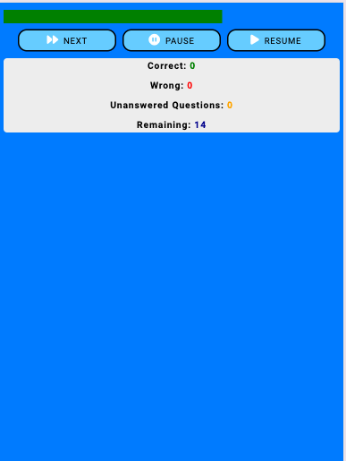
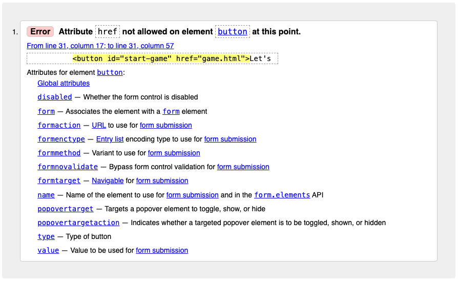

# Project Portfolio2 - WAEC Prep Arena(Test)

### Link to Deployed Site: [WAEC Prep Arena](https://samuel-senesie.github.io/pp2-waec-prep-arena-ci/)

---

## Introduction 
The WAEC Prep Arena Test game is the second portfolio project developed as part of the Code Institute’s Full-Stack Software Development Diploma course. This web-based, interactive test utilizes HTML, CSS, and JavaScript to create a front-end experience.

The game is specifically designed for students preparing for public examinations administered by the West African Examination Council (WAEC). It is particularly useful for Junior and Senior Secondary school students preparing for the Basic Education Certificate Examination (BECE) and the West African Senior Secondary Certificate Examination (WASSCE). However, it is also open to anyone interested in testing their knowledge in selected subjects.

The test is divided into two levels: Junior Secondary School (JSS) and Senior Secondary School (SSS), with four subjects available at each level. Each subject contains 15 questions, and each question offers four possible answers. Users are expected to select the correct answer within one minute. Upon completing the test, users are provided with a review of the questions, showing their selected answers alongside the correct ones to aid in learning.

A leaderboard displays each user's total score at the end of the test.

## Table of Contents

* [Introduction](#introduction)

* [User Experience](#user-experience)
  * [User Stories](#user-stories)

* [Design](#design)
  * [Wireframes](#wireframes)
  * [Color Sceme](#color-scheme)
  * [Typography](#typograpgy)
  * [Imagery](#imagery)

* [Feautures](#features)
  * [Current Features](#current-features)
    * [Home Page](#home-page)
    * [Test Page](#test-page)
  * [Future Features](#future-features) 

* [Validation](#validation)
  * [HTML](#html)
  * [CSS](#css)
  * [JavaScript](#javascripts)

* [Debugging](#debugging)
  * [Fixed Bug](#fixed-bugs)
  * [Bugs Not Fixed](#bugs-not-fixed)

* [Testing](#testing)
  * [Lighthouse Testing](#lighthouse-testing)
  * [Responsive Testing](#responsive-testing)
  * [Accessibility Testing](#accessibility-testing)
  * [Mannual Testing](#manual-testing)

* [Deployment & Local Deployment](#deployment-and-local-deployment)
  * [Remote Deployment](#remote-deployment)
  * [Local Deployment](#local-deployment)
    * [How to Fork](#how-to-fork)
    * [How to Clone](#how-to-clone)

* [Technologies Used](#technologies-used)

---

## User Experience
This project aims to deliver an interactive front-end website that provides a test game experience, primarily for students preparing for the BECE and WASSCE examinations.

---

### User Stories
  * I want to use the website on various devices, including smartphones, tablets, laptops, and desktops.
  * I want to understand the game rules and instructions before attempting the test.
  * I want to create a username.
  * I want to be able to select my preferred level, subject, and the year of the past examination question I wish to try.
  * I want to track my time and see how much time I have remaining.
  * I want to keep track of my scores and the remaining questions while playing.
  * I want to be able to pause and resume the test without losing time.
  * I want feedback indicating wheather my answeres are correct or incorrect and notifications when I pause or resume the game.
  * I want to see the review of the questions and the correct answeres at the end of the test.
  * I want an option to restart the game.
  * I want to see my score on the leaderboard.

  ---

## Design

### Wireframes
[Balsamiq](https://www.balsamiq.com) was used to create the wireframes for this project, covering mobile, tablet, and desktop versions. The final design differs slightly from the wireframes due to changes made during the development stage. Images of the wireframes are included in the attachments.
 

Wireframe for Mobile phones

Wireframe for Tablets

Wireframe for Desktops

### Color Scheme
Shades of blue were chosen as the primary colors for the website due to their association with confidence and intelegence. The color palette, shown in the image below, was generated using [Coolors](https://coolors.co/) tool.

The colour selection for the main features of the website is as follows:
  * #003366 was used for the background of the web pages.
  * #66CCFF was used as the primary colour for the buttons.
  * #007BFF was applied as the background color for popup windows and the test section.
  * #FFFFFF was used for the H1 elements and icons.
  * #000000 was used for H2, H3 and paragraph elements.
  * #008000 was used for the time bar.

### Typography
[Google Fonts](https://fonts.google.com/) was used to find an appropiate font family and generate and import the necessary code. Robot and san-serif fonts were selected as the primary font family for the website due to the readability and professional appearance. 

- 
---
### Imagery
Canva was used to generate the logo featured on the background image of the homepage. The book and graduation cap in the logo symbolize education and success.

---
## Features
### Current features
The website, which includes a visible favicon, consists of two main pages: `index.html` (Home page) and `game.html` (Test page). Both pages feature the logo as the background image, with an overlay to dim the background when pop-up windows or other dynamic features are displayed.

### Home page

The Home page features two buttons—“About Game” and “Let’s Go!”—with the logo as the background image. The “Let’s Go!” button navigates users to the test section. When clicked, the “About Game” button opens a pop-up window containing three buttons: one for the “Instructions” pop-up, one for the “Game Rules” pop-up, and one to close the pop-up window.

* Home

### Test Page
#### Username and Level Selection Section
To navigate to the test page, users click on the “Let’s Go!” button, which takes them to the section where they can enter a username and select a level. Users are only allowed to select a level after creating a username. Once a username is created and a level is selected, users can proceed to the subject selection section, which is loaded dynamically.

#### Subject Selection
Each level offers four subject options, and users can only select one subject at a time. After selecting a subject, users can navigate to the start page.

#### Select Year and Start Test
The start button on the start page is only functional after the user has selected the year of the past paper they wish to try from the dropdown menu.

#### Test display Section

* This section displays the test question with four answer options, a progress (timer) bar, in-page notifications, a score tracker, a next button, and pause and resume buttons.

* The question page with four answer options is displayed after clicking the start button. This page also features a timer bar and a score display section. Users are required to spend no more than 1 minute per question. The timer starts once the question is displayed. The timer bar, located just below the answers, is green and full at 60 seconds, turns orange and half-full at 30 seconds, and turns red when there are 10 seconds remaining.

*	During the test, users can pause and resume the game at will. When the game is paused, the questions and answer options are hidden, and the timer stops. The questions and answer options are displayed again when the user resumes, and the timer will continue running.

* Users receive notifications such as “Correct!” for correct answers, “Try again later!” for incorrect answers, “Do you want to come back later?” for skipped questions, and “Test completed” at the end of the test. Users are also informed when they click the pause or resume buttons.

* The score tracker is displayed at the bottom of the page, showing the count of correct, incorrect, and unanswered questions, as well as the number of questions remaining.

#### Test Review Section
At the end of the test, the review section will display all the questions, showing the user’s selected answers and the correct answers. A restart button is located at the bottom of the page, which users can use to navigate back to the level selection area and restart the test.

#### Leaderboard

At the end of the test, the user’s name, level, subject, and score (in percentage) are displayed on the leaderboard.

### Future Features
* A signup and login option for users.
* Hints to help users select the correct answers.
* Additional subject options, questions, and year selections.

---
### Deployment and Local Deployment
#### Deployment
To deploy this website on GitHub, the following steps were followed:
1.	**Log in to GitHub**, navigate to the repository, and click on the **Settings** tab.
2.	In the **Code and automation** section on the left sidebar, select Pages.
3.	Set the **Source** to **Deploy** from **Branch**, choose the **Main branch**, set the **Folder** to **root**, and click **Save**.
4.	Return to the **Code** tab and refresh the repository after waiting a few minutes.
5.	Under the **Environments** section on the right-hand side, click on **github-pages**.
6.	View the live site and URL by clicking **View deployment**.

The deployed page can be accessed [here](https://samuel-senesie.github.io/pp2-waec-prep-arena-ci/game.html)

---
#### Local Deployment
**How to Fork**
To fork this repository, follow these steps:
1.	Log in to GitHub and navigate to the repository: https://samuel-senesie.github.io/pp2-waec-prep-arena-ci/game.html.
2.	Click the **Fork** button at the top right-hand corner of the page.

**How to Clone**
To clone this repository, use the following steps:
1.	On **GitHub**, go to the repository page: https://samuel-senesie.github.io/pp2-waec-prep-arena-ci/game.html.
2.	Click the **Code** button and choose your preferred method to clone the repository. Copy the displayed link.
3.	Open your code editor and access the terminal. Change the current working directory to the location where you want to clone the repository.
4.	In the terminal, type **git clone**, paste the copied link, and press Enter.

## Validation
### HTML Validation

**Home Page**
* Error: Attribute ‘href’ not allowed on element button at this point (from line 31, column 17 to line 31, column 57).
* Solution: The ‘href’ attribute was removed, resolving the issue.

**Game Page**

* Error: Attribute ‘href’ not allowed on element button at this point (from line 41, column 13 to line 41, column 62).
* Solution: The ‘href’ attribute was removed, resolving the issue.
* Warning: Possible issue with ‘aria-label’ (from line 90, column 9 to line 90, column 81).
* Solution: The ‘aria-label’ attribute was removed, resolving the issue.
* Warning: The button role is unnecessary for the element (from line 120, column 17 to line 120, column 68).
* Solution: The button role was removed, resolving the issue.
* Warning: The button role is unnecessary for the element (from line 121, column 17 to line 121, column 70).
* Solution: The button role was removed, resolving the issue.

---
### CSS Validation
When the code was run through the W3C CSS Validator, the test returned two error messages, as shown in the image. The following steps were taken to correct the issues:
* Error 1: #leaderboard-section (line 129): Value error due to an incorrect operator (0, auto).
Solution: The comma was removed, resolving the issue.
* Error 2: .notification (line 477): Value error due to an incorrect operator (0, auto).
Solution: The comma was removed, resolving the issue.

---
### JavaScript Validation
The JavaScript code was validated using the JSHint tool. During testing, JSHint issued eight warnings for 'missing semicolons' and six warnings for 'unused variables,' as shown in the attached image. To resolve these issues, semicolons were added where needed, and the unused variables were commented out, clearing all warnings.

---
## Debugging
### Fixed bugs
The deployed website was tested for bugs, and several console errors were identified and corrected. Below are the details of each issue and its resolution, accompanied by the attached images.

1. **Start Test Function Error**
* **Error Message:** script.js:621 Uncaught TypeError: Cannot read properties of null (reading 'addEventListener') at HTMLDocument.`<anonymous>` (script.js:621:15)

* **Solution:** The script for the **startTest**  function was wrapped in an event listener, which resolved the error.

2. **Next Question Button Error**
* **Error Message:** script.js:817 Uncaught TypeError: Cannot read properties of null (reading 'addEventListener') at HTMLDocument.`<anonymous>` (script.js:817:18)

* **Solution:** The script for the **‘Next Question’** button function was wrapped in an event listener, successfully resolving the error.

3. **Pause Button Error**
* **Error Message:** script.js:852 Uncaught TypeError: Cannot read properties of null (reading 'addEventListener') at HTMLDocument.`<anonymous>` (script.js:852:11)

* **Solution:** The script for the **‘Pause’** button function was wrapped in an event listener, which cleared the error.

3. **Resume Button Error**
* **Error Message:** script.js:869 Uncaught TypeError: Cannot read properties of null (reading 'addEventListener') at HTMLDocument.`<anonymous>` (script.js:869:12)

* **Solution:** The script for the **‘Resume’** button function was wrapped in an event listener, resolving the error.

---

### Bugs Not Fixed
Currently, there are no unresolved or unidentified bugs.

---

## Testing
### Lighthouse Testing
Lighthouse testing was performed using Chrome DevTools to evaluate the website against four key criteria: Performance, Accessibility, Best Practices, and SEO. The Lighthouse test returned excellent results, with scores of 100 for Accessibility, Best Practices, and SEO, and a score of 99 for Performance on both the index and game pages. Please see the images of the Lighthouse test report for both pages below.

---
### Accessibility Testing
The web accessibility evaluation tool [WebAIM](https://wave.webaim.org/) was used to assess the accessibility features of the website. The test identified a contrast error, as shown in the image below. The issue was due to very low contrast (1.32:1) between the background color (#E0E0E0) and the H1 text color (#ffffff) on the review page. This error was resolved by changing the text color from #ffffff (white) to #cccccc (light grey) and applying a #003366 background color to the H1 element, improving the contrast ratio to 8.59:1.

---

### Manual Testing
A comprehensive manual testing process was conducted to verify that the various features of the website function as intended. Below is a breakdown of the test results:

| Feature | Expectation | Result | Proof(s) |
| ------- | ----------- | ------ | -------- |
| Homepage | The homepage should display the quiz name, logo, and two buttons: 'About Game' and 'Let’s Go!', allowing users to navigate to the quiz information and game page, respectively. | The homepage correctly displayed the 'Let’s Go!' and 'About Game' buttons, along with a background image featuring the quiz name and logo. |  |
| About Game Button  | Clicking this button should open a popup window displaying 'Instructions', 'Game Rules', and a 'Close' button to return to the homepage. | The 'About Game' button functioned as expected, opening the popup window with the 'Instructions', 'Game Rules', and 'Close' buttons. |  |
| Instructions Button  | Clicking the 'Instructions' button should show quiz instructions in a popup window with a 'Back' button to navigate back to the 'About Game' popup. | The 'Instructions' button worked as expected, displaying the instructions in a popup window with a 'Back' button. |  |
| Game Rules Button  | Clicking this button should display the test rules in a popup window, along with a 'Back' button to return to the 'About Game' popup. | The 'Game Rules' button functioned as intended, showing a list of rules and a 'Back' button. |  |
| Back Button (About Game)  | This button should return the user to the 'About Game' popup window when clicked. | The 'Back' button successfully navigated back to the 'About Game' popup window. |  |
| Close Button  | Clicking this button should close the 'About Game' popup window and display the homepage. | The 'Close' button functioned as expected, closing the popup and showing the homepage. |  |
| Let’s Go Button  | This button should navigate the user to the game page, displaying the username input field, leaderboard section, and level selection options. | The 'Let’s Go' button worked as expected, navigating to the game page with the username input, leaderboard, and level selection sections. |  |
| Username Input  | The username input field should allow users to create a username and save their level, subject selection, year, and score under it. | The username input functioned correctly, enabling users to create a username and save their score. | No image |
| Leaderboard Button  | Clicking this button should open a leaderboard section showing scores, with options to clear/reset the score and a 'Back' button to return to the level selection page. | The leaderboard button operated as expected, opening the leaderboard with displayed scores, 'clear', and 'back' buttons. |  |
| Level Selection Section | This section should provide buttons for selecting Junior (JSS) and Senior (SSS) levels. | The level selection section displayed as expected, with buttons for both Junior and Senior levels. |  |
| Junior (JSS) Level Selection Button  | Clicking this button should display the subjects under the JSS level. | The Junior (JSS) level selection button functioned as expected, displaying the JSS level subjects dynamically. |  |
| Senior (SSS) Level Selection Button  | This button should display the SSS level subjects when clicked. | The Senior (SSS) level selection button worked as intended, displaying the SSS level subjects. |  |
| Subject Selection Buttons  | After selecting a username and level, clicking any subject button should navigate the user to the year selection and start-test sections. | All subject buttons responded as expected, taking users to the year selection and start-test sections dynamically. |  |
| Year Selection Section | This section should show a year selection dropdown, along with 'Start Test' and 'Back' buttons. | The year selection section was displayed correctly, including the dropdown, 'Start Test', and 'Back' buttons. |  |
| Year Selection Dropdown  | Users should find a dropdown to select a past paper year. Currently, only 2019 is available in the question bank. | The year selection dropdown was displayed as expected, allowing users to select 2019. |  |
| Start-Test Button  | After entering a username and selecting a level, subject, and year, clicking this button should display the test section with questions. | The 'Start-Test' button functioned as expected, displaying the test section for the selected level, subject, and year. |  |
| Questions Display Section | This section should show the test question, four answer options (A to D), 'Next', 'Start', and 'Pause' buttons, along with a progress (Timer) bar. | The section displayed all the expected features correctly. |  |
| Next Button  | Clicking this button should skip to the next question, with an in-page notification saying 'Try again later!'. | The 'Next' button operated as expected, allowing users to skip questions, with the notification appearing as intended. |  |
| Pause Button  | Clicking this button should pause the test, hide the question and answer options, stop the timer, and display a notification saying 'You paused the Test!'. | The 'Pause' button functioned as expected, pausing the test and displaying the notification. |  |
| Resume Button  | This button should continue the test, with questions and answer options reappearing, the timer resuming, and a notification saying 'You resumed the test!'. | The 'Resume' button worked as intended, resuming the test and displaying the notification. |  |
| Timer Bar  | A timer bar should be present below the answer options, changing color based on time left: green at 60 seconds, orange at 30 seconds, and red at 10 seconds. The timer should pause and resume as per the 'Pause' and 'Resume' buttons. | The timer bar functioned as expected, changing colors according to the remaining time and pausing/resuming correctly. |  |
| Score Display Section | This section should track and display scores for correct, incorrect, unanswered, and skipped questions, as well as the remaining number of questions. | The score display section worked as expected, accurately tracking and displaying scores and question counts. |  |
| Test Review Section | After completing the test, a review section should display the subject name, year, all questions, selected answers, correct answers, and any unanswered/skipped questions. A 'Restart' button should be at the bottom. | The test review section functioned as expected, showing all the required information and including the 'Restart' button. |  |
|Restart Button  | Clicking this button should take the user back to the level selection section to restart the test. | The 'Restart' button worked as expected, navigating back to the level selection section. |  |
| Leaderboard Display | After clicking the leaderboard button, a section should appear showing a table with the username, level, subject, and score percentage. There should also be 'Clear' and 'Back' buttons. | The leaderboard display functioned as expected, showing the table with the required information and both 'Clear' and 'Back' buttons working as intended. |  |
| Clear Button  | When clicked, this button should clear all data in the leaderboard. | The feature functioned as expected, successfully clearing all the data in the leaderboard upon being clicked. |  |
| Back Button  | This button should navigate the user back to the level selection section when clicked. | The feature responded as intended, taking the user back to the level selection section. |  |

---

## Credits

* The popup menu was learnt ad adapted from the YouTube Tutorial of [Codingflag](https://youtu.be/iE_6pQ3RlZU?si=6_qy3F1wWourONax)

* Fonts: Sourced and imported from Google Fonts.
* Icons: Sourced from Font Awesome.
* * Logo and Background Image: Created using Canva.
* Color Palette: Generated using the Coolors tool.
* JavaScript Code for Font Awesome Kit: Imported from Font Awesome.
* ChatGPT: Utilized to generate questions for the question bank (excluding JSS level English questions), edit the content of the README document, debug JavaScript code, and serve as a reference and learning guide for the project.
* Website Inspiration and Design: Based on the Love Maths Walkthrough Project from the Code Institute's Full Stack Software Development Diploma Course

